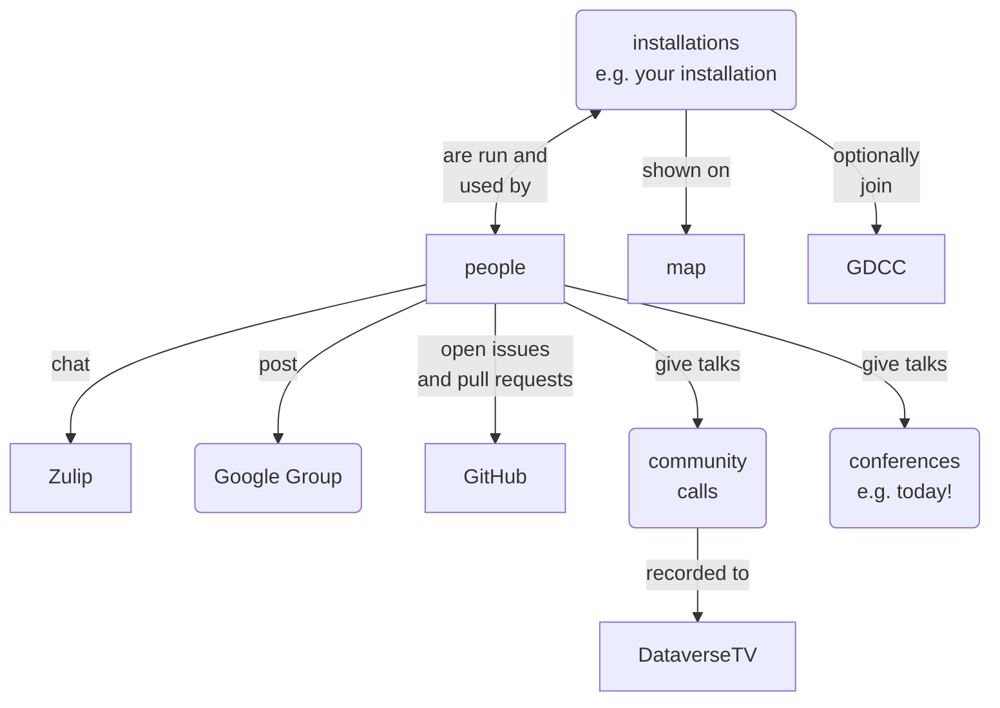

```mermaid
flowchart
i(installations<br>e.g. your installation) -- are run and<br>used by <--> people
i -- shown on --> map
i -- optionally<br>join --> GDCC
people -- chat --> Zulip
people -- post --> g(Google Group)
people -- open issues<br>and pull requests --> GitHub
people -- give talks --> cc(community<br>calls)
cc -- recorded to --> DataverseTV
people -- give talks --> conf(conferences<br>e.g. today!)
```